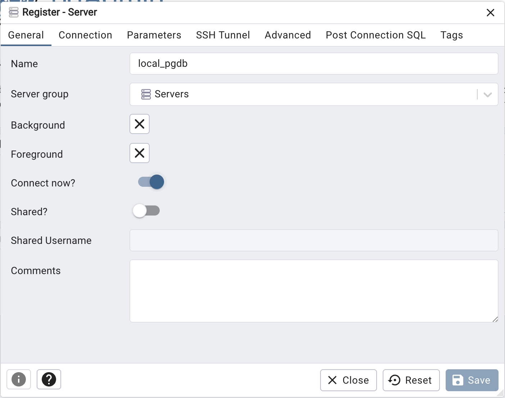
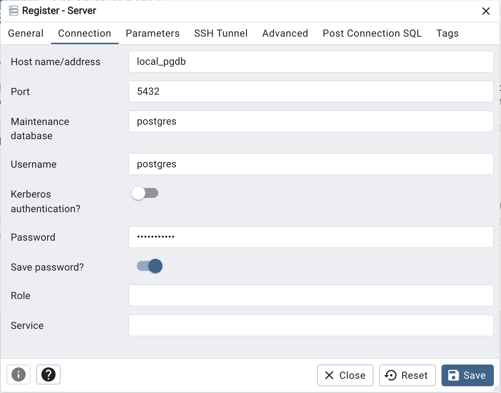
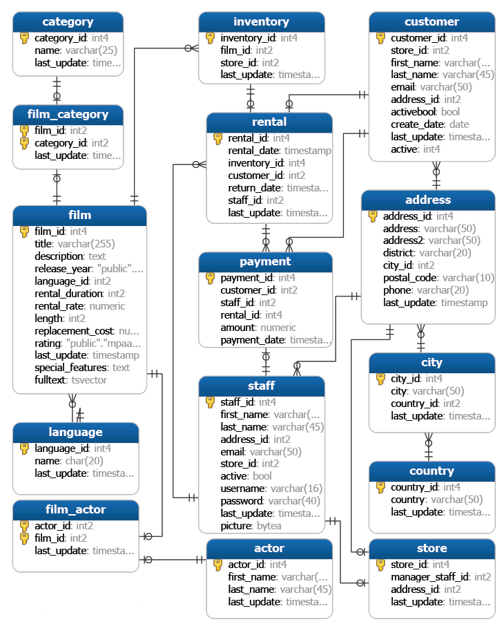

# The Complete SQL Bootcamp: Go from Zero to Hero

SQL (Structured Query Language) Course notes

Requirements:

- [Docker](https://docs.docker.com/engine/install/)
- [docker-compose](https://docs.docker.com/compose/)
- [GNU Make](https://www.gnu.org/software/make/)

How To

```Bash
# Run the containers in a detached mode
make up

# Stop the containers, removing volumes as well
make down

# NOTE: With out -v for down command, volumes will persist
# and in the event of changing a user/pass wont take effect

# Setup dvdrental DB from Backup
make db/dvdrental

# Setup exercises DB from Backup
make db/exercises

# Open on the browser http://localhost:8888 to log on PGAdmin
# User: PGADMIN_DEFAULT_EMAIL
# Pass: PGADMIN_DEFAULT_PASSWORD
# As indicated in the docker-compose-yaml file
```

Setup the DB Connection in PGAdmin


Add the new connection - General



Add the new connection - Connectivity



## PostgreaSQL Example



## SQL Cheat Sheet


## SQL Examples

This section contains a collection of `SQL` example commands ran on the `dvdrental` Data Base.

```SQL
-- Select specific columns from table
SELECT first_name, last_name, email FROM customer;

/* SELECT DISTINCT
What ratings do we have available (PG, PG-13, R, etc)
*/
SELECT DISTINCT(rating) FROM film;

/* COUNT
How many unique first names in the customer table
*/
SELECT COUNT(DISTINCT(first_name)) FROM customer;

/* WHERE
How many movie titles where:
    - rental_rate is bigger than 4
    - replacement_cost is bigger or equal than 19.99
    - rating is R
*/
SELECT COUNT(title) FROM film
WHERE rental_rate > 4 AND replacement_cost >= 19.99
AND rating='R';

/* How many movie titles where:
    - rating is R
    - OR rating is PG-13
*/
SELECT COUNT(title) FROM film
WHERE rating = 'R' OR rating = 'PG-13';

/* ORDER BY
    - customers
    - store_id DECRESCENT
    - first_name ASCENDING 
*/
SELECT first_name, last_name FROM customer
ORDER BY store_id DESC, first_name ASC;

-- The 10 most recent purchases bigger than 0 in payment table
SELECT * FROM payment
WHERE amount != 0
ORDER BY payment_date DESC
LIMIT 10;

-- What are the titles of the 5 shortest (in length of runtime) movies?
SELECT title, film.length AS len FROM film
ORDER BY len ASC
LIMIT 5;

/* BETWEEN
How many payments between 8 and 9 $USD
*/
SELECT COUNT(*) FROM payment
WHERE amount BETWEEN 8 AND 9;

/* All the payments that happened on the first half of Feb
NOTE: to include payments on the 14th then use 15th as end date
*/
SELECT * FROM payment
WHERE payment_date BETWEEN '2007-02-01' AND '2007-02-15';

/* IN
- How many payments in specific set
- Customers with first_name in specific set
*/
SELECT COUNT(*) FROM payment
WHERE amount IN (0.99, 1.98, 1.99);

SELECT * FROM customer
WHERE first_name IN ('John', 'Jake', 'Julie');

/* LIKE
How Many Customers name starts with the letter J
*/
SELECT COUNT(*) FROM customer
WHERE first_name LIKE 'J%';

/* ILIKE
The names of customers that first amd last names starts with J
NOTE: Using ILIKE to use Not case-sensitive query
*/
SELECT * FROM customer
WHERE first_name ILIKE 'j%' AND last_name ILIKE 'j%';
```

### General Challenge

```SQL
-- 1) How many payment transactions were greater than $5.00?
SELECT COUNT(amount) FROM payment
WHERE amount > 5.00;

-- 2) How many actors have a first name that starts with the letter P
SELECT COUNT(first_name) FROM actor
WHERE first_name LIKE 'P%';

-- 3) How many unique districts are our customers from?
SELECT COUNT(DISTINCT(district)) FROM address;

-- 4) Retrieve the list of names for those unique districts
SELECT DISTINCT(district) FROM address;

-- 5) How many films with R rating and replacement cost between $5 $15
SELECT COUNT(*) FROM film
WHERE rating = 'R' AND replacement_cost BETWEEN 5.00 AND 15.00;

-- 6) How many films have the word Truman somewhere in the title?
SELECT COUNT(*) FROM film
WHERE title LIKE '%Truman%';
```

### Most Common Aggregate Functions

```SQL
/*
- AVG() average value - Use with ROUND() for decimal precision
- COUNT() number of values
- MAX() maximum value
- MIN() minimum value
- SUM() sum of all values
*/

-- Max and Min replacement costs for a film
SELECT MAX(replacement_cost), MIN(replacement_cost) FROM film;

-- Average replacement cost for a film, with 2 decimal digits
SELECT ROUND(AVG(replacement_cost), 2) FROM film;

-- The cost to replace ALL the films
SELECT SUM(replacement_cost) AS total_replacement_cost FROM film;

-- GROUP BY

-- Top 10 customers expending the most many in total
SELECT customer_id, SUM(amount) FROM payment
GROUP BY customer_id
ORDER BY SUM(amount) DESC
LIMIT 10;

-- Top 10 customer that rented most amount of films
SELECT customer_id, COUNT(customer_id) as rental_amount FROM payment
GROUP BY customer_id
ORDER BY rental_amount DESC
LIMIT 10;

-- Top 10 Dates of amount sales
SELECT DATE(payment_date) AS sale_date, SUM(amount) FROM payment
GROUP BY sale_date
ORDER BY SUM(amount) DESC
LIMIT 10;
```

### `GROUP BY` Challenge

```SQL
-- 1) How many payments did each staff memeber handle
SELECT staff_id, COUNT(*) FROM payment
GROUP BY staff_id
ORDER BY COUNT(*) DESC;

-- 2) What is the average replacement cost per MPAA rating
SELECT rating, ROUND(AVG(replacement_cost), 2) FROM film
GROUP BY rating

-- 3) Top 5 customer that expend the most
SELECT customer_id, SUM(amount) FROM payment
GROUP BY customer_id
ORDER BY SUM(amount) DESC
LIMIT 5;
```

### Examples using `HAVING`

```SQL
-- Get the customers that most expend, excluding ids 184, 87, 477
SELECT customer_id, SUM(amount) AS total_expend FROM payment
WHERE customer_id NOT IN (184, 87, 477)
GROUP BY customer_id
ORDER BY total_expend DESC;

-- Expand above with, where the total_expend is bigger than 150
SELECT customer_id, SUM(amount) FROM payment
WHERE customer_id NOT IN (184, 87, 477)
GROUP BY customer_id
HAVING SUM(amount) > 150
ORDER BY SUM(amount) DESC;

-- Which stores has more than 300 customers
SELECT store_id, COUNT(customer_id) FROM customer
GROUP BY store_id
HAVING COUNT(customer_id) > 300;
```

### `HAVING` Challenge

```SQL
-- 1) Which customer ids has more than 40 or more transaction payments
SELECT customer_id, COUNT(*) FROM payment
GROUP BY customer_id
HAVING COUNT(*) >= 40;

-- 2) Curstomer Ids that spent more than $100 in with staff Id 2
SELECT customer_id, SUM(amount) FROM payment
WHERE staff_id = 2
GROUP BY customer_id
HAVING SUM(amount) > 100;
```

### SQL Assesment Test 1

```SQL
-- 1) Return the customer IDs that have spent at least $110 with the staff member Id 2
SELECT customer_id, SUM(amount) FROM payment
WHERE staff_id = 2
GROUP BY customer_id
HAVING SUM(amount) >= 110;

-- 2) How many films begin with the letter J
SELECT COUNT(title) FROM film
WHERE title LIKE('J%');

-- 3) Which customer has the highest ID number whose name starts with 'E' and address ID lower than 500
SELECT first_name, last_name FROM customer
WHERE first_name LIKE('E%') AND address_id < 500
ORDER BY customer_id DESC
LIMIT 1;

-- Example with the AS Statement
SELECT COUNT(amount) AS num_of_transactions FROM payment;

SELECT customer_id, SUM(amount) AS total_spent FROM payment
GROUP BY customer_id
HAVING SUM(amount) > 100;
```

### `Join`

```SQL
/* INNER JOIN
    - Set of records that match in both tables
    - Intersection of a Ven diagram
*/
SELECT payment_id,
       payment.customer_id,
       first_name,
       last_name,
       email
FROM payment
INNER JOIN customer
ON payment.customer_id = customer.customer_id;

/* OUTER JOIN
    - Values only present in one of the tables being joined
*/

-- FULL OUTER JOIN
SELECT * FROM customer
FULL OUTER JOIN payment
ON customer.customer_id = payment.customer_id;

/* 
Expanding above to get if any customer hasnt done any payment
and if any payment is not associated with a customer 
*/
SELECT * FROM customer
FULL OUTER JOIN payment
ON customer.customer_id = payment.customer_id
WHERE customer.customer_id IS null OR payment.payment_id IS null;

/* LEFT OUTER JOIN
    - Recrods that are in the left table
    - If there is no match with the right table, the results are null, - Order matters 
*/
-- films that are in the film table, but NOT in the inventory
SELECT film.film_id, film.title, inventory_id, store_id FROM film
LEFT OUTER JOIN inventory ON
inventory.film_id = film.film_id
WHERE inventory.film_id IS null;

-- RIGHT JOIN same as a LEFT JOIN, except that the tables are switched
-- UNION basically serves to directly concatenate two results together
```

### `JOIN` Challenge Tasks

```SQL
-- 1) Which are the emails of the customers who lives in California
SELECT email FROM customer
INNER JOIN address
ON customer.address_id = address.address_id
WHERE address.district = 'California';

-- 2) List of all the movies where 'Nick Wahlberg' has been in
SELECT title from film
INNER JOIN film_actor ON film.film_id = film_actor.film_id
INNER JOIN actor ON actor.actor_id = film_actor.actor_id
WHERE actor.first_name = 'Nick' AND actor.last_name = 'Wahlberg';
```

### Timestamps and Extract functionality

```SQL
-- Get the set of years from the payment_date col on the payment table
SELECT DISTINCT(EXTRACT(YEAR FROM payment_date)) AS pay_year FROM payment;

-- Get the age of the payment_date col on the payment table
SELECT AGE(payment_date) FROM payment;

-- Format the timestamp from payment_date to Character, get unique values
SELECT DISTINCT(TO_CHAR(payment_date, 'YYYY-MM-dd')) FROM payment;
```

### `EXTRACT` Challenge Tasks

```SQL
-- 1) During which months did payments occur, format to return the month name
SELECT DISTINCT(TO_CHAR(payment_date, 'MONTH'))
AS payment_month
FROM payment;

-- 2) How many payments occurred on a Monday?
SELECT COUNT(*) FROM payment
WHERE EXTRACT(DOW FROM payment_date) = 1;
```

### Math functions

```SQL
-- Whats the percentage of the rental_rate compared to the replacement_cost
SELECT rental_rate, replacement_cost, ROUND(rental_rate / replacement_cost, 4)
AS rent_cost_percentage FROM film;

-- How much would be to charge a deposit of the 10% of the replacement_cost?
SELECT replacement_cost * 0.1 AS deposit FROM film;
```

### String functions and Operators

```SQL
-- Length
SELECT LENGTH(first_name) from actor;

-- Concatenation
SELECT first_name || '_' || last_name AS full_name FROM customer;

/* Create Emails for the customers with the following requirements
- everything lowercase
- first letter from the first_name
- follow by a '.' and last_name
- at gmail.com
*/
SELECT LOWER(LEFT(first_name, 1)) || '.' || LOWER(last_name) || '@gmail.com' 
AS customer_email from customer;
```

### SubQuery

```SQL
-- Get a list of films that the rental rate is higher than the rental rate average
SELECT title, rental_rate FROM film
WHERE rental_rate > (SELECT ROUND(AVG(rental_rate), 2) FROM film);

/* 
Get a list of films ordered by title that were returned between the 29th and 30th of May
    - From rental table get the return_date
    - related inventory_id on rental and inventory tables
    - use film to check titles IN that subquery result to display
*/
SELECT film_id, title FROM film
WHERE film_id IN
(SELECT inventory.film_id FROM rental
INNER JOIN inventory ON inventory.inventory_id = rental.inventory_id
WHERE return_date BETWEEN '2005-05-29' AND '2005-05-30')
ORDER BY title;

-- Get as list of first name and last name of customers who paid more than $11
SELECT first_name || ' ' || last_name AS customers FROM customer AS c
WHERE EXISTS
(SELECT amount FROM payment as p
WHERE p.customer_id = c.customer_id
AND amount > 11);

/* Self-Join
is a query in which a table is joined to itself, this type of joins
are useful for comparing values in a column of rows within the same table
*/

-- Find of the pair of films that have the same length
SELECT f1.title, f2.title, f2.length FROM film AS f1
INNER JOIN film AS f2 ON
f1.length = f2.length AND f1.title != f2.title;
```

### SQL Assessment Test 2

**NOTE:** The Data Base used is `exercises` checkout the How To section to setup

```SQL
-- NOTE: the Database used as a "cd" schema
/*
1) How can you retrieve all the information from the
cd.facilities table?
*/
SELECT * FROM cd.facilities;

/*
2) You want to print out a list of all of the facilities and their cost to members.
How would you retrieve a list of only facility names and costs?
*/
SELECT name, membercost FROM cd.facilities;

/*
3) How can you produce a list of facilities that charge a fee to members?
*/
SELECT name FROM cd.facilities
WHERE membercost > 0;

/*
4) Produce a list of facilities that charge a fee to members, 
    - Fee is less than 1/50th of the monthly maintenance cost
    - Return the facid, name, membercost, and monthlymaintenance
*/
SELECT facid, name, membercost, monthlymaintenance FROM cd.facilities
WHERE membercost != 0 AND (membercost < monthlymaintenance / 50);

/*
5) List of all facilities with the word 'Tennis' in their name?
*/
SELECT name FROM cd.facilities
WHERE name LIKE('%Tennis%');

/*
6) Retrieve the details of facilities with ID 1 and 5?
Try to do it without using the OR operator.
*/
SELECT * FROM cd.facilities
WHERE facid IN(1, 5);

/*
8) Produce a list of members who joined after the start of September 2012?
Return the memid, surname, firstname, and joindate of the members in question.
*/
SELECT memid, surname, firstname, joindate from cd.members
WHERE joindate >= '2012-09-01';

/*
8) Produce an ordered list of the first 10 surnames in the members table? 
The list must not contain duplicates.
*/
SELECT DISTINCT(surname) from cd.members
ORDER BY surname ASC
LIMIT 10;

/*
9) You'd like to get the signup date of your last member.
*/
SELECT joindate FROM cd.members
ORDER BY joindate DESC
LIMIT 1;

-- Other way
SELECT MAX(joindate) FROM cd.members;

/*
10) Produce a count of the number of facilities that have a cost to guests of 10 or more.
*/
SELECT COUNT(facid) FROM cd.facilities
WHERE guestcost >= 10;

/*
11) Produce a list of the total number of slots booked per facility in 
the month of September 2012. 
Produce an output table consisting of facility id and slots, sorted by the number of slots.
*/
SELECT facid, SUM(slots) FROM cd.bookings
WHERE EXTRACT(MONTH FROM starttime) = 9
GROUP BY facid
ORDER BY SUM(slots) ASC;

/*
12) Produce a list of facilities with more than 1000 slots booked. 
Produce an output table consisting of:
facility id and total slots, sorted by facility id.
*/
SELECT facid, SUM(slots) from cd.bookings
GROUP BY facid
HAVING SUM(slots) > 1000
ORDER BY facid ASC;

/*
13) Produce a list of bookings start times for tennis courts, 
on the date '2012-09-21'?
Return a list of start time and facility name pairings, ordered by the time.
*/
SELECT name, starttime FROM cd.facilities
INNER JOIN cd.bookings
ON cd.bookings.facid = cd.facilities.facid
WHERE starttime BETWEEN '2012-09-21' AND '2012-09-22' AND name LIKE('Tennis Court _')
ORDER BY starttime ASC;

/*
14) Produce a list of the start times for bookings by members named 'David Farrell'?
*/
SELECT starttime FROM cd.bookings
INNER JOIN cd.members
ON cd.bookings.memid = cd.members.memid
WHERE members.firstname = 'David' AND members.surname = 'Farrell';

-- Other way
SELECT starttime FROM cd.bookings
WHERE memid =
(SELECT memid FROM cd.members
WHERE firstname = 'David' AND surname = 'Farrell');
```

Concepts:

- `Primary Key` is a column or a group of columns used to identify a row uniquely in a table.
- `Foreign Key` is a field or group of fields in a table that uniquely identifies a row in another table. In the example of the `dvdrental` database `payment` table, each payment row had its unique `payment_id` (a primary key) and identified the customer that made the payment through the `customer_id` a foreign key since it references the `customer` table's primary key.
- `Constaints` are the rules enforced on data columns on a table, to prevent invalid data from being entered into the database:
- `Column Constraints`:
  - `NOT NULL` ensures that a column cannont have a `NULL` value
  - `UNIQUE` ensures that all values in a column are different
  - `PRIMARY KEY` Uniquely identifies each row/record
  - `FOREIGN KEY` Constrains data based on columns in other tables
  - `CHECK` Ensures that all values in a column satisfy certain conditions
  - `REFERENCES` To constrain the value stored in the column that must exist in a column in another table
- `Table Constraints`:
  - For example a table could have several columns as Primary Key

### Create Tables

```SQL
-- CREATE TABLE General Syntax
CREATE TABLE table_name (
    col1_name TYPE col1_constraint,
    col2_name TYPE col2_constraint,
    table_constraint_2 table_constraint_3
) INHERITS existing_table_ame;

-- INSERT General Syntax
INSERT INTO table (col1, col2)
VALUES
    (val11, val21),
    (val12, val22)

-- INSERT from another table
INSERT INTO table (col1, col2)
SELECT col1, col2 FROM another_table
WHERE condition;

-- NOTE: SERIAL columns do not need to be provided a value
-- After creating the 'learning' DB via PGAdmin
CREATE TABLE account(
    user_id SERIAL PRIMARY KEY,
    username VARCHAR(50) UNIQUE NOT NULL,
    email VARCHAR(250) UNIQUE NOT NULL,
    created_on TIMESTAMP NOT NULL,
    last_login TIMESTAMP
);

-- Tables creation
CREATE TABLE account(
    user_id SERIAL PRIMARY KEY,
    username VARCHAR(50) UNIQUE NOT NULL,
    email VARCHAR(250) UNIQUE NOT NULL,
    created_on TIMESTAMP NOT NULL,
    last_login TIMESTAMP
);

CREATE TABLE job(
    job_id SERIAL PRIMARY KEY,
    job_name VARCHAR(200) UNIQUE NOT NULL
);

CREATE TABLE account_job(
    user_id INTEGER REFERENCES account(user_id),
    job_id INTEGER REFERENCES job(job_id),
    hire_data TIMESTAMP
)

ALTER TABLE account_job
RENAME COLUMN hire_data TO hire_date;

-- Inser data
INSERT INTO account(username, email, created_on)
VALUES
('Leo', 'leo.mana@gmail.com', CURRENT_TIMESTAMP);

SELECT * FROM account;

INSERT INTO job(job_name)
VALUES
('Data Engineer'),
('Data Analyst');

SELECT * FROM job;

INSERT INTO account_job(user_id, job_id, hire_date)
VALUES
(1, 1, CURRENT_TIMESTAMP);

SELECT * FROM account_job;

/* 
NOTE: If attempt to INSERT a job_id or user_id that does not exist on the related table, it will throw "violates foreign key constraint"
*/

-- Update the value of a colum that was null
UPDATE account
SET last_login = CURRENT_TIMESTAMP
WHERE user_id = 1
RETURNING username, email;

-- Update/set the values from another table
UPDATE account_job
SET hire_date = account.created_on
FROM account
WHERE account_job.user_id = account.user_id
RETURNING user_id, job_id, hire_date;

-- Delete from table
INSERT INTO job(job_name)
VALUES
('Wrong Role');

DELETE FROM job
WHERE job_name = 'Wrong Role'
RETURNING job_id, job_name

-- ALTER Table and DROP
CREATE TABLE IF NOT EXISTS information(
    info_id SERIAL PRIMARY KEY,
    info_name VARCHAR(200) UNIQUE NOT NULL
);

ALTER TABLE information
RENAME COLUMN info_name TO info_title

SELECT * FROM information;

ALTER TABLE information
DROP COLUMN IF EXISTS info_title;

-- CHECK Constraint
CREATE TABLE employees(
emp_id SERIAL PRIMARY KEY,
first_name VARCHAR(50) NOT NULL,
last_name VARCHAR(50),
birthdate DATE CHECK(birthdate > '1900-01-01'),
hire_date DATE CHECK(hire_date > birthdate),
salary INTEGER CHECK(salary > 0)
);

INSERT INTO employees(
first_name,
last_name,
birthdate,
hire_date,
salary
)
VALUES ('Leo', 'Mana', '1983-07-12', '2025-05-12', 200000)
RETURNING *;
```

### SQL Assesment 3

```SQL
/*
Complete the following task:

Create a new database called "School" this database should have two tables:
    - teachers:
        - cols: teacher_id, first_name, last_name, homeroom_number, department, email, phone

    - students:
        - cols: student_id, first_name, last_name, homeroom_number, phone, email, grad_year

The constraints consider the following:
- Must have a phone number to contact students in case of an emergency.
- Must have ids as the primary key of the tables.
- Phone numbers and emails must be unique to the individual.

Insert
- teacher:
    - names Jonas Salk (teacher_id = 1)
    - homeroom number of 5
    - From the Biology department.
    - email jsalk@school.org
    - phone number of 777-555-4321

- student: 
    - named Mark Watney (student_id=1)
    - phone number of 777-555-1234
    - doesn't have an email.
    - He graduates in 2035
    - Has 5 as a homeroom number.

Keep in mind that these insert tasks may affect your constraints!
*/

-- Teachers Table
CREATE TABLE IF NOT EXISTS teachers(
    teacher_id SERIAL PRIMARY KEY,
    first_name VARCHAR(50) NOT NULL,
    last_name VARCHAR(50) NOT NULL,
    homeroom_number INTEGER CHECK(homeroom_number > 0),
    department VARCHAR(50) NOT NULL,
    email VARCHAR(200) NOT NULL,
    phone VARCHAR(20) NOT NULL
);

-- This INSERT will NOT have constraint error
INSERT INTO teachers(first_name, last_name, homeroom_number, department, email, phone)
VALUES ('Jonas', 'Salk', 5, 'Biology', 'jsalk@school.org', '777-555-4321')
RETURNING *;

-- Students Table
CREATE TABLE IF NOT EXISTS students(
    student_id SERIAL PRIMARY KEY,
    first_name VARCHAR(50) NOT NULL,
    last_name VARCHAR(50) NOT NULL,
    homeroom_number INTEGER CHECK(homeroom_number > 0),
    email VARCHAR(200) NOT NULL UNIQUE CHECK(LENGTH(email) > 0),
    phone VARCHAR(20) NOT NULL UNIQUE,
    grad_year DATE CHECK(EXTRACT(YEAR FROM grad_year) > '2035')
);

-- This INSERT WILL have constraint error
INSERT INTO students(first_name, last_name, homeroom_number, email, phone, grad_year)
VALUES ('Mark', 'Watney', 5, '', '777-555-1234', '2036-01-01')
RETURNING *;

-- Fix
INSERT INTO students(first_name, last_name, homeroom_number, email, phone, grad_year)
VALUES ('Mark', 'Watney', 5, 'm.watney@school.com', '777-555-1234', '2036-01-01')
RETURNING *;
```

### Conditional Expression and Procedures

```SQL
-- CASE conditions

-- Category for custoer signed in first
SELECT customer_id,
CASE
    WHEN (customer_id <= 100) THEN 'premium'
    WHEN (customer_id BETWEEN 100 AND 200) THEN 'plus'
ELSE 'regular'
END AS customer_category
FROM customer
ORDER BY customer_category DESC;

-- Checking by equality, example with a raffle on customer_id
SELECT customer_id,
CASE customer_id
    WHEN 2 THEN 'winner'
    WHEN 5 THEN 'place_2'
    WHEN 7 THEN 'place_3'
ELSE 'no_winner'
END AS raffle_results
FROM customer
ORDER BY raffle_results DESC;

/*
When a movie rental_rate is:
    - 0.99 is bargain
    - 2.99 is regular
    - 4.99 is premium
*/
SELECT 
SUM(CASE rental_rate WHEN 0.99 THEN 1 ELSE 0 END) AS bargains,
SUM(CASE rental_rate WHEN 2.99 THEN 1 ELSE 0 END) AS regular,
SUM(CASE rental_rate WHEN 4.99 THEN 1 ELSE 0 END) AS regular
FROM film;

-- Challenge, how many on PG13, PG and R Rating categories
SELECT 
SUM(CASE rating WHEN 'PG-13' THEN 1 ELSE 0 END) AS pg13,
SUM(CASE rating WHEN 'PG' THEN 1 ELSE 0 END) AS pg,
SUM(CASE rating WHEN 'R' THEN 1 ELSE 0 END) AS r
FROM film;
```

### `COALESCE`, `CAST` and `NULLIF`

```SQL
/* COALESCE 
Accepts an unlimited number of args, returns the first arg that is not null
If all the args are null, it returns null, a default can be setup
*/

/* CAST
This operator lets u convert from one data type into another
*/

-- Count the amount of characters on each value of the inventory_id
SELECT inventory_id, CHAR_LENGTH(CAST(inventory_id AS VARCHAR)) as chars FROM rental;

/* NULLIF
This function takes 2 inputs and return NULL if both are equal
otherwise it returns the first argument passed
*/
CREATE TABLE depts(
first_name VARCHAR(50),
department VARCHAR(50)
);

INSERT INTO depts(first_name, department)
VALUES
('Vinton', 'A'),
('Lauren', 'A'),
('Claire', 'B');

SELECT * FROM depts;

-- Get the ratio on how many people in Department A compared with B
SELECT (
SUM(CASE WHEN department = 'A' THEN 1 ELSE 0 END) /
SUM(CASE WHEN department = 'B' THEN 1 ELSE 0 END)
)*100 AS department_ratio_A_to_B FROM depts;

-- Delete department B in order to create a devide by zero problem
DELETE FROM depts
WHERE department = 'B';

SELECT * FROM depts;

-- So now if the ratio query above is run will return an 'division by zero' Error

-- Then NULLIF will return null as bellow
SELECT NULLIF(SUM(CASE WHEN department = 'B' THEN 1 ELSE 0 END), 0) FROM depts;

-- Then when something is devided by Null will return Null instead of the error
SELECT (
SUM(CASE WHEN department = 'A' THEN 1 ELSE 0 END) /
NULLIF(SUM(CASE WHEN department = 'B' THEN 1 ELSE 0 END), 0)
)*100 AS department_ratio_A_to_B FROM depts;
```

### References

- Contact: [Leandro Mana](https://www.linkedin.com/in/leandro-mana-2854553b/)
- Udemy [course](https://www.udemy.com/course/the-complete-sql-bootcamp)
- [A Visual Explanation of SQL Joins](https://blog.codinghorror.com/a-visual-explanation-of-sql-joins/)
- [Wikipedia SQL JOIN](https://en.wikipedia.org/wiki/Join_(SQL))
- [Postgresql Pattern Matching](https://www.postgresql.org/docs/current/functions-matching.html)
- [Postgresql Aggregate Functions](https://www.postgresql.org/docs/current/tutorial-agg.html)
- [Postgresql Math Functions](https://www.postgresql.org/docs/9.5/functions-math.html)
- [Postgresql String Functions and Operators](https://www.postgresql.org/docs/9.5/functions-string.html)
- [Postgresql SQL copy](https://www.postgresql.org/docs/current/sql-copy.html)
- [Backup and Restore PostgreSQL DB Using Docker](https://medium.com/@vinayakchittora/backup-and-restore-postgresql-database-using-docker-9e145e974ab6)
